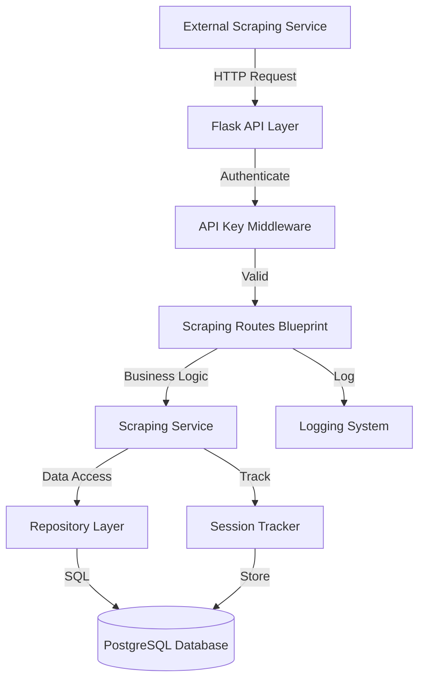
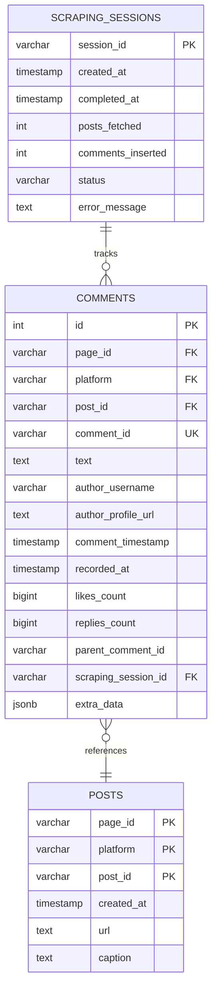

# Design Document: External Scraping Service API

## Overview

This feature provides a secure, transactional API integration layer that enables an external scraping service to fetch posts from the e-rep backend database and insert scraped comments back into the system. The design emphasizes data integrity, zero data loss, and accurate tracking of scraping operations.

### Core Capabilities

1. **Post Fetching Endpoint**: REST API endpoint that returns filtered post lists with unique session tracking
2. **Comment Insertion Endpoint**: Atomic bulk comment insertion with duplicate detection and transaction safety
3. **Session Tracking**: Audit trail for all scraping operations with metadata and status tracking
4. **API Key Authentication**: Secure access control using API keys with rate limiting
5. **Transactional Safety**: ACID guarantees for all write operations with rollback on failure

### Design Goals

- **Zero Data Loss**: All operations are transactional with rollback on any failure
- **Accurate Tracking**: Every fetch and insertion is logged with session identifiers and counts
- **Idempotency**: Duplicate comment detection prevents redundant insertions
- **Security**: API key authentication with rate limiting and request logging
- **Maintainability**: Follows existing codebase patterns (repository layer, service layer, blueprint structure)

## Architecture

### System Components



### Layer Responsibilities

#### 1. Routes Layer (`api/routes/scraping_routes.py`)
- HTTP request handling and validation
- Request parameter extraction and sanitization
- Response formatting (success/error)
- Blueprint error handler registration
- Authentication enforcement via decorator

#### 2. Service Layer (`api/services/scraping_service.py`)
- Business logic orchestration
- Session creation and tracking
- Validation of comment batches
- Transaction coordination
- Duplicate detection logic

#### 3. Repository Layer
- **`api/repositories/comment_repository.py`**: Comment CRUD operations
- **`api/repositories/scraping_session_repository.py`**: Session tracking operations
- Raw SQL query execution
- Database exception handling

#### 4. Models Layer
- **`api/models/comment_model.py`**: Comment table ORM definition
- **`api/models/scraping_session_model.py`**: ScrapingSession table ORM definition

### Data Flow

#### Post Fetching Flow
```
1. External service sends GET /api/scraping/posts with filters
2. API Key Middleware validates authentication
3. ScrapingService creates new ScrapingSession record
4. PostRepository fetches filtered posts from posts_mv
5. ScrapingService records session_id, timestamp, post_count
6. Response includes posts array + session_id
```

#### Comment Insertion Flow
```
1. External service sends POST /api/scraping/comments with comment batch
2. API Key Middleware validates authentication
3. ScrapingService validates all comments (required fields, post references)
4. CommentRepository checks for duplicates
5. Begin database transaction
6. CommentRepository inserts new comments (skip duplicates)
7. ScrapingSession updated with comments_inserted count
8. Commit transaction (or rollback on any failure)
9. Response includes inserted_count, skipped_count, session_id
```

## Components and Interfaces

### 1. Comment Model

**File**: `api/models/comment_model.py`

**Database Table**: `comments`

```python
class Comment(db.Model):
    __tablename__ = "comments"
    
    # Primary Key
    id = db.Column(db.Integer, primary_key=True, autoincrement=True)
    
    # Composite Foreign Key to Post (page_id, platform, post_id)
    page_id = db.Column(db.String(36), nullable=False)
    platform = db.Column(db.String(20), nullable=False)
    post_id = db.Column(db.String(100), nullable=False)
    
    # Comment Identification
    comment_id = db.Column(db.String(100), nullable=False)  # Platform's comment ID
    
    # Comment Content
    text = db.Column(db.Text, nullable=False)
    
    # Author Information
    author_username = db.Column(db.String(100), nullable=False)
    author_profile_url = db.Column(db.Text, nullable=True)
    
    # Timestamps
    comment_timestamp = db.Column(db.DateTime, nullable=False)  # When comment was posted
    recorded_at = db.Column(db.DateTime, nullable=False, default=datetime.utcnow)
    
    # Metrics
    likes_count = db.Column(db.BigInteger, default=0, nullable=False)
    replies_count = db.Column(db.BigInteger, default=0, nullable=False)
    
    # Nested Comments Support
    parent_comment_id = db.Column(db.String(100), nullable=True)
    
    # Session Tracking
    scraping_session_id = db.Column(db.String(36), 
                                     db.ForeignKey("scraping_sessions.session_id", ondelete="SET NULL"),
                                     nullable=True)
    
    # Platform-Specific Metadata
    extra_data = db.Column(db.JSON, nullable=True)
    
    # Constraints
    __table_args__ = (
        db.UniqueConstraint('page_id', 'platform', 'post_id', 'comment_id', 
                           name='uq_comment_composite'),
        db.Index('ix_comment_post_lookup', 'page_id', 'platform', 'post_id'),
        db.Index('ix_comment_session', 'scraping_session_id'),
    )
```

**Design Decisions**:
- **Composite unique constraint** on (page_id, platform, post_id, comment_id) prevents duplicate comments
- **Foreign key** to scraping_sessions with `SET NULL` on delete preserves comments if session is deleted
- **Indexed lookups** on post composite key and session_id for efficient queries
- **JSON extra_data** field for platform-specific attributes (verified status, edited flag, etc.)
- **BigInteger** for metrics to handle high engagement counts
- **No foreign key constraint** on posts to avoid insertion failures due to eventual consistency

### 2. ScrapingSession Model

**File**: `api/models/scraping_session_model.py`

**Database Table**: `scraping_sessions`

```python
class ScrapingSession(db.Model):
    __tablename__ = "scraping_sessions"
    
    # Primary Key
    session_id = db.Column(db.String(36), primary_key=True, default=lambda: str(uuid.uuid4()))
    
    # Timestamps
    created_at = db.Column(db.DateTime, nullable=False, default=datetime.utcnow)
    completed_at = db.Column(db.DateTime, nullable=True)
    
    # Tracking Metrics
    posts_fetched = db.Column(db.Integer, default=0, nullable=False)
    comments_inserted = db.Column(db.Integer, default=0, nullable=False)
    
    # Status Tracking
    status = db.Column(db.String(20), default="pending", nullable=False)
    # Possible values: "pending", "completed", "failed"
    
    # Error Handling
    error_message = db.Column(db.Text, nullable=True)
    
    # Relationships
    comments = relationship("Comment", back_populates="scraping_session", passive_deletes=True)
    
    __table_args__ = (
        db.CheckConstraint(status.in_(["pending", "completed", "failed"]), 
                          name='ck_session_status'),
    )
```

**Design Decisions**:
- **UUID session_id** provides globally unique identifiers for distributed systems
- **Status enum** tracks session lifecycle (pending → completed/failed)
- **Nullable completed_at** allows tracking session duration
- **Error message field** stores failure details for debugging
- **Relationship to comments** enables querying all comments for a session

### 3. CommentRepository

**File**: `api/repositories/comment_repository.py`

**Interface**:

```python
@instrument_repository_class
class CommentRepository:
    
    @staticmethod
    def create(comment_data: dict, commit: bool = True) -> Comment:
        """Insert a single comment."""
        
    @staticmethod
    def bulk_create(comments_data: list[dict], commit: bool = True) -> tuple[int, int]:
        """
        Insert multiple comments in a transaction.
        Returns: (inserted_count, skipped_count)
        """
        
    @staticmethod
    def exists(page_id: str, platform: str, post_id: str, comment_id: str) -> bool:
        """Check if a comment already exists."""
        
    @staticmethod
    def get_by_composite_key(page_id: str, platform: str, 
                             post_id: str, comment_id: str) -> Comment | None:
        """Fetch a single comment by composite key."""
        
    @staticmethod
    def get_by_post(page_id: str, platform: str, post_id: str) -> list[Comment]:
        """Get all comments for a specific post."""
        
    @staticmethod
    def get_by_session(session_id: str) -> list[Comment]:
        """Get all comments inserted during a specific scraping session."""
        
    @staticmethod
    def count_by_post(page_id: str, platform: str, post_id: str) -> int:
        """Count comments for a specific post."""
```

### 4. ScrapingSessionRepository

**File**: `api/repositories/scraping_session_repository.py`

**Interface**:

```python
@instrument_repository_class
class ScrapingSessionRepository:
    
    @staticmethod
    def create(posts_fetched: int, commit: bool = True) -> ScrapingSession:
        """Create a new scraping session with initial post count."""
        
    @staticmethod
    def get_by_id(session_id: str) -> ScrapingSession | None:
        """Fetch a session by ID."""
        
    @staticmethod
    def update_status(session_id: str, status: str, 
                     error_message: str = None, commit: bool = True) -> ScrapingSession:
        """Update session status and optional error message."""
        
    @staticmethod
    def increment_comments(session_id: str, count: int, commit: bool = True) -> ScrapingSession:
        """Increment the comments_inserted counter."""
        
    @staticmethod
    def complete_session(session_id: str, commit: bool = True) -> ScrapingSession:
        """Mark session as completed with timestamp."""
        
    @staticmethod
    def get_all(limit: int = 100, offset: int = 0) -> list[ScrapingSession]:
        """Get all sessions with pagination."""
```

### 5. ScrapingService

**File**: `api/services/scraping_service.py`

**Interface**:

```python
@instrument_service_class
class ScrapingService:
    
    @staticmethod
    def fetch_posts_for_scraping(platform: str = None, 
                                  start_date: str = None, 
                                  end_date: str = None) -> dict:
        """
        Fetch posts matching filters and create scraping session.
        
        Returns: {
            "session_id": str,
            "posts": list[dict],
            "count": int
        }
        """
        
    @staticmethod
    def insert_comment_batch(comments_data: list[dict], 
                            session_id: str = None) -> dict:
        """
        Validate and insert comment batch atomically.
        
        Returns: {
            "inserted": int,
            "skipped": int,
            "session_id": str
        }
        """
        
    @staticmethod
    def validate_comment_data(comment: dict) -> tuple[bool, str]:
        """
        Validate a single comment's required fields.
        
        Returns: (is_valid, error_message)
        """
        
    @staticmethod
    def get_session_details(session_id: str) -> dict | None:
        """
        Retrieve complete session information.
        
        Returns: {
            "session_id": str,
            "created_at": str,
            "completed_at": str | None,
            "posts_fetched": int,
            "comments_inserted": int,
            "status": str,
            "error_message": str | None
        }
        """
```

### 6. Scraping Routes Blueprint

**File**: `api/routes/scraping_routes.py`

**Endpoints**:

#### GET /api/scraping/posts

**Purpose**: Fetch posts for scraping with optional filters

**Authentication**: Required (API Key)

**Query Parameters**:
- `platform` (optional): Filter by platform (facebook, instagram, x, tiktok, linkedin, youtube)
- `start_date` (optional): Filter posts created after this date (ISO 8601 format)
- `end_date` (optional): Filter posts created before this date (ISO 8601 format)

**Response** (200 OK):
```json
{
  "success": true,
  "data": {
    "session_id": "550e8400-e29b-41d4-a716-446655440000",
    "posts": [
      {
        "page_id": "123e4567-e89b-12d3-a456-426614174000",
        "platform": "instagram",
        "post_id": "C12345678",
        "url": "https://instagram.com/p/C12345678",
        "created_at": "2024-01-15T10:30:00Z",
        "caption": "Post caption text..."
      }
    ],
    "count": 150
  }
}
```

**Error Responses**:
- 400: Invalid query parameters
- 401: Missing or invalid API key
- 429: Rate limit exceeded
- 500: Database error

#### POST /api/scraping/comments

**Purpose**: Insert scraped comments in bulk

**Authentication**: Required (API Key)

**Request Body**:
```json
{
  "session_id": "550e8400-e29b-41d4-a716-446655440000",
  "comments": [
    {
      "page_id": "123e4567-e89b-12d3-a456-426614174000",
      "platform": "instagram",
      "post_id": "C12345678",
      "comment_id": "17890123456789",
      "text": "Great post!",
      "author_username": "user123",
      "author_profile_url": "https://instagram.com/user123",
      "comment_timestamp": "2024-01-15T12:45:00Z",
      "likes_count": 5,
      "replies_count": 2,
      "parent_comment_id": null,
      "extra_data": {
        "is_verified": true
      }
    }
  ]
}
```

**Response** (200 OK):
```json
{
  "success": true,
  "data": {
    "session_id": "550e8400-e29b-41d4-a716-446655440000",
    "inserted": 48,
    "skipped": 2,
    "total": 50
  }
}
```

**Error Responses**:
- 400: Invalid request body or validation failure
- 401: Missing or invalid API key
- 404: Referenced post does not exist
- 429: Rate limit exceeded
- 500: Database error (transaction rolled back)

#### GET /api/scraping/sessions/{session_id}

**Purpose**: Retrieve scraping session details

**Authentication**: Required (API Key)

**Response** (200 OK):
```json
{
  "success": true,
  "data": {
    "session_id": "550e8400-e29b-41d4-a716-446655440000",
    "created_at": "2024-01-15T08:00:00Z",
    "completed_at": "2024-01-15T09:30:00Z",
    "posts_fetched": 150,
    "comments_inserted": 487,
    "status": "completed",
    "error_message": null
  }
}
```

**Error Responses**:
- 401: Missing or invalid API key
- 404: Session not found
- 500: Database error

### 7. API Key Authentication

**Implementation**: Decorator function `@require_api_key`

**File**: `api/utils/api_key_auth.py`

```python
def require_api_key(func):
    """
    Decorator to enforce API key authentication.
    Expects API key in Authorization header: "Bearer <api_key>"
    """
    @wraps(func)
    def wrapper(*args, **kwargs):
        # Extract API key from Authorization header
        # Validate against environment variable SCRAPING_API_KEY
        # Log authentication attempt
        # Return 401 if invalid
        # Check rate limit
        # Return 429 if exceeded
        # Proceed to route handler if valid
        return func(*args, **kwargs)
    return wrapper
```

**Configuration**:
- API key stored in environment variable: `SCRAPING_API_KEY`
- Rate limit: 100 requests per minute per API key (configurable)
- Rate limit storage: In-memory cache (Redis in production)

## Data Models

### Database Schema

```sql
-- Comments Table
CREATE TABLE comments (
    id SERIAL PRIMARY KEY,
    page_id VARCHAR(36) NOT NULL,
    platform VARCHAR(20) NOT NULL,
    post_id VARCHAR(100) NOT NULL,
    comment_id VARCHAR(100) NOT NULL,
    text TEXT NOT NULL,
    author_username VARCHAR(100) NOT NULL,
    author_profile_url TEXT,
    comment_timestamp TIMESTAMP NOT NULL,
    recorded_at TIMESTAMP NOT NULL DEFAULT NOW(),
    likes_count BIGINT NOT NULL DEFAULT 0,
    replies_count BIGINT NOT NULL DEFAULT 0,
    parent_comment_id VARCHAR(100),
    scraping_session_id VARCHAR(36),
    extra_data JSONB,
    CONSTRAINT uq_comment_composite UNIQUE (page_id, platform, post_id, comment_id),
    CONSTRAINT fk_scraping_session FOREIGN KEY (scraping_session_id) 
        REFERENCES scraping_sessions(session_id) ON DELETE SET NULL
);

CREATE INDEX ix_comment_post_lookup ON comments(page_id, platform, post_id);
CREATE INDEX ix_comment_session ON comments(scraping_session_id);

-- Scraping Sessions Table
CREATE TABLE scraping_sessions (
    session_id VARCHAR(36) PRIMARY KEY,
    created_at TIMESTAMP NOT NULL DEFAULT NOW(),
    completed_at TIMESTAMP,
    posts_fetched INTEGER NOT NULL DEFAULT 0,
    comments_inserted INTEGER NOT NULL DEFAULT 0,
    status VARCHAR(20) NOT NULL DEFAULT 'pending',
    error_message TEXT,
    CONSTRAINT ck_session_status CHECK (status IN ('pending', 'completed', 'failed'))
);
```

### Entity Relationships



## Error Handling

### Error Categories

#### 1. Validation Errors (HTTP 400)

**Scenarios**:
- Missing required fields in comment data
- Invalid data types (e.g., string for integer field)
- Invalid platform value
- Invalid date format
- Empty comment batch

**Response Format**:
```json
{
  "success": false,
  "error": "Validation failed: missing required field 'comment_id' in comment at index 5"
}
```

**Handling**:
- Validate all request parameters before database operations
- Use schema validation for comment batches
- Return descriptive error messages indicating which field/index failed

#### 2. Authentication Errors (HTTP 401)

**Scenarios**:
- Missing Authorization header
- Invalid API key format
- API key does not match configured value

**Response Format**:
```json
{
  "success": false,
  "error": "Invalid or missing API key"
}
```

**Handling**:
- Check API key in decorator before route execution
- Log all authentication failures
- Do not expose details about key format or validation

#### 3. Resource Not Found Errors (HTTP 404)

**Scenarios**:
- Referenced post does not exist in posts_mv
- Scraping session not found

**Response Format**:
```json
{
  "success": false,
  "error": "Scraping session not found: 550e8400-e29b-41d4-a716-446655440000"
}
```

**Handling**:
- Check post existence before allowing comment insertion
- Return specific resource identifiers in error messages

#### 4. Rate Limit Errors (HTTP 429)

**Scenarios**:
- API key exceeds 100 requests per minute

**Response Format**:
```json
{
  "success": false,
  "error": "Rate limit exceeded. Try again in 30 seconds."
}
```

**Handling**:
- Track request count per API key using in-memory cache
- Reset counter every minute
- Include Retry-After header in response

#### 5. Database Errors (HTTP 500)

**Scenarios**:
- Transaction rollback due to constraint violation
- Database connection failure
- Foreign key constraint violation

**Response Format**:
```json
{
  "success": false,
  "error": "An error occurred in the database."
}
```

**Handling**:
- Rollback transaction on any database error
- Log full error details internally
- Return generic error message to client (no internal details)
- Update scraping session status to "failed" with error message

#### 6. Server Errors (HTTP 500)

**Scenarios**:
- Unexpected exceptions
- Service layer logic errors

**Response Format**:
```json
{
  "success": false,
  "error": "An error occurred in the server."
}
```

**Handling**:
- Catch all unhandled exceptions
- Log full stack trace internally
- Return generic error message to client

### Error Logging Strategy

All errors are logged using the existing `log_route_error` utility with appropriate severity levels:

- **Low Severity**: Validation errors, authentication failures
- **Medium Severity**: Rate limit violations, resource not found
- **High Severity**: Database errors, transaction rollbacks, unexpected exceptions

**Log Format** (following existing pattern):
```json
{
  "timestamp": "2024-01-15T10:30:00.000Z",
  "severity": "high",
  "category": "route_error",
  "status_code": 500,
  "public_message": "An error occurred in the database.",
  "error_type": "SQLAlchemyError",
  "error_message": "Detailed internal error message",
  "stack_trace": "Full stack trace...",
  "request": {
    "method": "POST",
    "url": "/api/scraping/comments",
    "endpoint": "insert_comments",
    "data": "[REDACTED]"
  }
}
```

### Transaction Management

All write operations use explicit transaction management:

```python
# Example: Comment insertion with transaction
try:
    # Begin implicit transaction (Flask-SQLAlchemy)
    inserted, skipped = CommentRepository.bulk_create(comments_data, commit=False)
    ScrapingSessionRepository.increment_comments(session_id, inserted, commit=False)
    db.session.commit()  # Commit all or nothing
    return success_response({"inserted": inserted, "skipped": skipped})
except SQLAlchemyError as e:
    db.session.rollback()  # Rollback on any error
    ScrapingSessionRepository.update_status(session_id, "failed", str(e))
    log_route_error(e, SEVERITY_HIGH, 500, "Comment insertion failed")
    return db_error_response(500)
```

## Testing Strategy

### Unit Tests

**Test Files**:
- `tests/unit/test_comment_repository.py`
- `tests/unit/test_scraping_session_repository.py`
- `tests/unit/test_scraping_service.py`

**Coverage**:

1. **CommentRepository Tests**:
   - `test_create_comment`: Insert single comment with all fields
   - `test_create_comment_minimal`: Insert with only required fields
   - `test_bulk_create_comments`: Insert multiple comments successfully
   - `test_bulk_create_with_duplicates`: Skip duplicates, insert new ones
   - `test_exists_returns_true_for_existing`: Check duplicate detection
   - `test_get_by_composite_key`: Fetch comment by composite key
   - `test_get_by_post`: Fetch all comments for a post
   - `test_get_by_session`: Fetch all comments for a session
   - `test_count_by_post`: Count comments for a post

2. **ScrapingSessionRepository Tests**:
   - `test_create_session`: Create new session with post count
   - `test_get_by_id`: Fetch session by ID
   - `test_update_status_to_completed`: Update session status
   - `test_update_status_with_error`: Update status with error message
   - `test_increment_comments`: Increment comments counter
   - `test_complete_session`: Mark session as completed with timestamp

3. **ScrapingService Tests**:
   - `test_validate_comment_data_valid`: Validate complete comment
   - `test_validate_comment_data_missing_fields`: Detect missing required fields
   - `test_fetch_posts_creates_session`: Session created on fetch
   - `test_fetch_posts_with_platform_filter`: Filter posts by platform
   - `test_fetch_posts_with_date_range`: Filter posts by date range
   - `test_insert_comment_batch_success`: All comments inserted
   - `test_insert_comment_batch_with_duplicates`: Skip duplicates correctly
   - `test_insert_comment_batch_validation_failure`: Reject invalid batch
   - `test_get_session_details`: Retrieve session information

### Integration Tests

**Test File**: `tests/integration/test_scraping_api.py`

**Coverage**:

1. **POST /api/scraping/comments**:
   - `test_insert_comments_success`: Complete end-to-end insertion
   - `test_insert_comments_with_duplicates`: Duplicate handling
   - `test_insert_comments_validation_error`: Invalid data rejection
   - `test_insert_comments_missing_api_key`: Authentication required
   - `test_insert_comments_invalid_api_key`: Wrong API key rejected
   - `test_insert_comments_transaction_rollback`: Rollback on failure
   - `test_insert_comments_updates_session`: Session updated correctly

2. **GET /api/scraping/posts**:
   - `test_fetch_posts_success`: Returns posts with session ID
   - `test_fetch_posts_with_platform_filter`: Platform filtering works
   - `test_fetch_posts_with_date_filter`: Date range filtering works
   - `test_fetch_posts_creates_session_record`: Session persisted
   - `test_fetch_posts_missing_api_key`: Authentication required
   - `test_fetch_posts_invalid_query_params`: Invalid params rejected

3. **GET /api/scraping/sessions/{session_id}**:
   - `test_get_session_details_success`: Returns session data
   - `test_get_session_details_not_found`: 404 for invalid session
   - `test_get_session_details_missing_api_key`: Authentication required

4. **Authentication and Rate Limiting**:
   - `test_api_key_in_header`: API key from Authorization header
   - `test_rate_limit_enforced`: 429 after 100 requests
   - `test_rate_limit_resets`: Counter resets after 1 minute

### Test Database Setup

Tests use SQLite in-memory database with schema matching production PostgreSQL:

```python
@pytest.fixture
def app():
    os.environ["TESTING"] = "true"
    app = create_app()
    with app.app_context():
        db.create_all()
        yield app
        db.session.remove()
        db.drop_all()
```

### Test Data Fixtures

```python
@pytest.fixture
def sample_post():
    """Create a test post in posts_mv view"""
    return {
        "page_id": "123e4567-e89b-12d3-a456-426614174000",
        "platform": "instagram",
        "post_id": "C12345678",
        "url": "https://instagram.com/p/C12345678",
        "created_at": datetime(2024, 1, 15, 10, 30, 0),
        "caption": "Test post caption"
    }

@pytest.fixture
def sample_comment():
    """Sample comment data for testing"""
    return {
        "page_id": "123e4567-e89b-12d3-a456-426614174000",
        "platform": "instagram",
        "post_id": "C12345678",
        "comment_id": "17890123456789",
        "text": "Great post!",
        "author_username": "user123",
        "author_profile_url": "https://instagram.com/user123",
        "comment_timestamp": datetime(2024, 1, 15, 12, 45, 0),
        "likes_count": 5,
        "replies_count": 2
    }
```

### Coverage Target

- **Overall code coverage**: 90%+
- **Critical paths** (insertion, validation, transaction management): 100%
- **Error handling paths**: 100%

### Test Execution

```bash
# Run all tests
pytest tests/

# Run with coverage
pytest --cov=api.repositories.comment_repository \
       --cov=api.repositories.scraping_session_repository \
       --cov=api.services.scraping_service \
       --cov=api.routes.scraping_routes \
       --cov-report=html

# Run only integration tests
pytest tests/integration/

# Run with verbose output
pytest -v tests/
```

## Correctness Properties

*A property is a characteristic or behavior that should hold true across all valid executions of a system—essentially, a formal statement about what the system should do. Properties serve as the bridge between human-readable specifications and machine-verifiable correctness guarantees.*

While this feature is primarily CRUD-based API integration with infrastructure concerns (database transactions, authentication, rate limiting), there are several universal properties that can be verified through property-based testing. These properties focus on the validation logic, filtering behavior, and data integrity constraints that should hold across all inputs.

### Property 1: Post Filtering Correctness

*For any* combination of filter parameters (platform, start_date, end_date), all posts returned by the fetch endpoint SHALL match the specified filter criteria.

**Validates: Requirements 1.2, 1.3, 1.4**

### Property 2: Response Structure Completeness

*For any* successful post fetch request, every post in the response SHALL contain all required fields: page_id, platform, post_id, url, created_at, and caption.

**Validates: Requirements 1.5, 1.6**

### Property 3: Session Uniqueness

*For any* sequence of post fetch requests (regardless of filters or timing), all generated session_id values SHALL be unique.

**Validates: Requirements 1.7**

### Property 4: Session Tracking Accuracy

*For any* post fetch request, the created scraping session record SHALL have a posts_fetched count that exactly matches the number of posts returned in the response.

**Validates: Requirements 1.8**

### Property 5: Invalid Parameter Rejection

*For any* query parameter value that does not conform to the expected format or constraints (invalid platform name, malformed date string, negative integers), the fetch endpoint SHALL reject the request with HTTP 400 status and a descriptive error message.

**Validates: Requirements 1.10, 1.11**

### Property 6: Comment Validation Completeness

*For any* comment batch submitted for insertion, IF any comment is missing required fields (page_id, platform, post_id, comment_id, text, author_username, comment_timestamp) OR references a non-existent post, THEN the entire batch SHALL be rejected with a validation error message indicating the specific failure.

**Validates: Requirements 2.2, 2.3, 2.4, 10.2, 10.3**

### Property 7: Duplicate Prevention

*For any* comment that already exists in the database (matching page_id, platform, post_id, comment_id), attempting to insert that comment again SHALL result in the comment being skipped (not inserted) and included in the skipped count.

**Validates: Requirements 2.10, 2.11, 2.12**

### Property 8: Insertion Count Accuracy

*For any* valid comment batch insertion, the sum of inserted_count and skipped_count in the response SHALL equal the total number of comments in the batch, and the inserted_count SHALL match the actual number of new rows in the database.

**Validates: Requirements 2.7, 2.9, 2.12**

### Property 9: Session Association Persistence

*For any* comment batch inserted with a session_id, all successfully inserted comments SHALL have their scraping_session_id field set to that session_id value in the database.

**Validates: Requirements 2.8**

### Property 10: Authentication Enforcement

*For any* request to a scraping endpoint (POST /api/scraping/comments, GET /api/scraping/posts, GET /api/scraping/sessions/*) without a valid API key in the Authorization header, the system SHALL reject the request with HTTP 401 status.

**Validates: Requirements 6.1, 6.3, 6.4**

### Property 11: Data Type Validation

*For any* comment field that has a specific data type constraint (likes_count and replies_count must be integers, comment_timestamp must be valid datetime, text must be string), providing a value of incorrect type SHALL result in validation rejection with HTTP 400 status.

**Validates: Requirements 10.6**

### Implementation Notes for Property-Based Tests

Each correctness property above should be implemented as a property-based test using a Python PBT library (recommended: **Hypothesis**). Each test must:

- Run a minimum of 100 iterations to ensure comprehensive input coverage
- Include a comment tag referencing the property: `# Feature: external-scraping-service-api, Property N: [property text]`
- Generate diverse test inputs using Hypothesis strategies (strings, dates, integers, structures)
- Assert the property holds for all generated inputs

**Example Test Structure**:

```python
from hypothesis import given, strategies as st

@given(
    platform=st.sampled_from(["facebook", "instagram", "x", "tiktok", "linkedin", "youtube", None]),
    start_date=st.dates() | st.none(),
    end_date=st.dates() | st.none()
)
def test_post_filtering_correctness(platform, start_date, end_date):
    # Feature: external-scraping-service-api, Property 1: Post Filtering Correctness
    """
    For any combination of filter parameters (platform, start_date, end_date),
    all posts returned by the fetch endpoint SHALL match the specified filter criteria.
    """
    # Test implementation...
```

**Testing Strategy Balance**:

- **Property-based tests**: Verify the 11 universal properties above across randomized inputs
- **Unit tests**: Test repository methods, service methods, and utility functions with specific examples
- **Integration tests**: Test transaction rollback, database constraints, rate limiting, and end-to-end API flows with 2-3 concrete examples

This dual approach ensures both universal correctness (via PBT) and practical behavior verification (via example-based tests).
